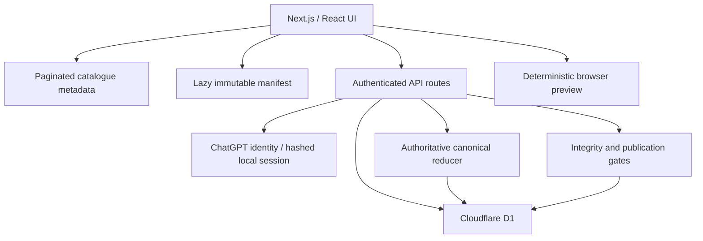

# GENESIS: JURIS Web

Professional web platform for building, reviewing and playing versioned legal simulations. The product combines a searchable case library, a visual Case Studio, practitioner feedback, targeted updates and a compliance-first international tax authoring model.

The hosted professional beta is available at <https://genesis-juris-web.maxim-hayan.chatgpt.site>.

## Product scope

- Trusted ChatGPT identity plus an optional local email/password credential, offline recovery and professional profiles with opt-in communications controls.
- Paginated metadata library with server-side search/classification and lazy loading of immutable versioned manifests.
- Five mobile-parity library cases with their complete canonical stages/actions, deterministic events, clocks, deadlines, visible evidence/inbox state, resumable authoritative sessions, live spend/workload ledgers and verdict economics.
- Case Studio workspace for visual authoring, graph validation, draft submission and case/node feedback.
- Central publication and addressed release updates with immutable version lineage and read receipts.
- Moderated practitioner feedback tied to an exact case version and fingerprint.
- Tax / offshore tax-engineering template restricted to lawful planning and requiring source provenance plus a named, structured publication attestation.

Bundled cases are labelled as professional beta material unless an independent verified practitioner review is attached to the exact submitted fingerprint. The product is an educational simulation platform, not legal or tax advice.

## Architecture



The Cloudflare Worker adds CSP, HSTS and browser hardening headers while preserving public immutable caching and private/no-store APIs. Write routes enforce same-origin JSON mutations, bounded streaming bodies, server-side authorization and canonical SHA-256 fingerprints. See [the v14 architecture and trust boundaries](docs/ARCHITECTURE.md).

### Core data model

- `users`: profile, locale, practice areas and explicit communication preferences.
- `local_accounts`, `auth_sessions`, `account_recovery_codes`: email-bound password credentials, hashed opaque sessions and one-time offline recovery. Passwords and bearer secrets are never stored in plaintext.
- `auth_rate_limit_events`, `auth_audit_events`: credential-abuse throttling and a security-event trail; `platform_secrets` holds server-only cryptographic material.
- `cases`: current catalogue metadata and current immutable content identity.
- `case_versions`: payload history, parent identity, studio fingerprint and publication record.
- `custom_cases`, `custom_case_grants`: owner envelope, privacy state and explicit restricted-case grants.
- `case_drafts`: per-user Studio workspace and independent review evidence.
- `play_sessions`, `play_events`: revisioned authoritative runtime state and idempotent decision history.
- `case_feedback`: exact-version feedback, context, severity, citations and moderation state.
- `case_subscriptions`, `updates`, `update_reads`: addressed release communication.
- `audit_events`: privileged publication and moderation trail.

Migrations live in `drizzle/`. A fresh database must apply them in numeric order.

## Integrity and governance

- Central publication deterministically compiles the normalized Studio graph on the server; client previews cannot replace the authoritative manifest.
- Rules DSL v1 uses bounded declarative node runtime fields, action effects, guards and repeatability without authored code execution.
- A saved JSON artifact can carry `case-protection-v1`: the server binds its current-version code, parent code, Studio fingerprint and copy policy with HMAC-SHA256. A locked parent makes all descendants locked; recipients receive inspection-only product access. This is tamper-evident lineage and authorization, not encryption or DRM.
- Option IDs are globally unique; stages, clocks, timing and deadline routes are checked for ambiguity or dead ends.
- Current v14 bundled content and retained v13 beta versions have stable fingerprints; pinned v13 sessions continue to resolve against their archived manifests.
- A case version can have only one child for a parent identity and only one root, preventing concurrent publication forks.
- Studio saves use optimistic fingerprint concurrency and fail stale writers with `409` rather than silently overwriting another tab.
- Elevated review labels require timestamped accepted review evidence bound to the exact Studio and playable fingerprints.
- An `expert` label additionally requires an independent verified practitioner; the author, publisher and reviewer cannot collapse into the same identity.
- Tax cases are fail-closed to lawful/compliance scope, complete publication metadata and a named structured attestation bound to both fingerprints.
- `Private` custom cases are owner-only at the application API; this is authorization, not encryption or DRM.
- Browser-only Studio persistence is available to signed-in users, identity-scoped and limited to local, unprotected, non-Private drafts. It is cleared on sign-out; anonymous, workspace, protected and Private artifacts are never cached in local storage.

## Local development

Requirements: Node.js `>=22.13.0`, Linux, `flock`, `curl` and GNU `timeout`.

```bash
npm run install:ci
npm run dev
```

The local runtime reads `.openai/hosting.json` for the D1 binding name. Production environment values such as `GENESIS_ADMIN_EMAILS` belong in Sites runtime configuration, never in the repository.

## Verification

```bash
npx tsc --noEmit --incremental false
npm run lint
npm test
npm audit --omit=dev
git diff --check
```

`npm test` performs a production build and replays eleven authoritative mobile reference paths across all five bundled cases, including exact outcomes, clocks, economics, next-workday recovery, global repeatability, legacy session compatibility, tax/graph gates, request limits, D1 migrations and immutable lineage constraints.

## Authentication and authorization

Sites dispatch owns `/signin-with-chatgpt`, `/signout-with-chatgpt` and `/callback`, including OAuth cookies and trusted identity-header injection. `app/chatgpt-auth.ts` exposes safe helpers for optional sign-in and same-origin return paths.

After a trusted ChatGPT identity confirms the account email once, `/account` can enroll a local password. The password policy is 10–128 characters with at least one uppercase letter, one digit and one special character. The database stores PBKDF2-HMAC-SHA256 output (600,000 iterations) and a per-account random salt, never the password. Local sessions and recovery codes are high-entropy opaque values stored only as SHA-256 hashes; reset/recovery rotates the offline code and revokes earlier sessions. Because no transactional mail provider is bound, the current forgot-password paths are the display-once offline recovery code or the same trusted ChatGPT identity—not an unsafe unverified email reset.

The public catalogue is anonymous-compatible. Profiles, feedback, subscriptions and Studio submissions use server-side identity. Local identity can exercise the same email-based case ACL after enrollment proved by a trusted ChatGPT identity, but never confers platform-administrator status. Administration requires both the trusted ChatGPT identity source and the runtime `GENESIS_ADMIN_EMAILS` allowlist.

See [the local-authentication threat model and lifecycle](docs/AUTHENTICATION.md) for storage, recovery, deletion and operational limits.

## Deployment

This project is deployed through ChatGPT Sites. `.openai/hosting.json` declares the `DB` D1 binding. The release workflow validates and commits source, saves a Sites version, applies migrations and deploys that saved version to production.
