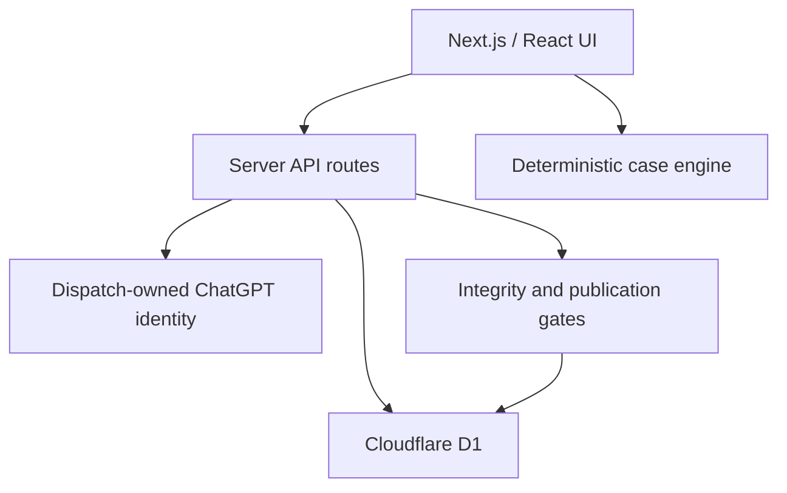

# GENESIS: JURIS Web

Professional web platform for building, reviewing and playing versioned legal simulations. The product combines a searchable case library, a visual Case Studio, practitioner feedback, targeted updates and a compliance-first international tax authoring model.

The hosted professional beta is available at <https://genesis-juris-web.maxim-hayan.chatgpt.site>.

## Product scope

- ChatGPT sign-in and professional profiles with opt-in communications controls.
- Structured case library with jurisdiction, practice-area, difficulty, duration, tags, version and legal-as-of filters.
- Playable branching cases with deterministic clocks, deadlines, consequences and debrief metrics.
- Case Studio workspace for visual authoring, graph validation, draft submission and case/node feedback.
- Central publication and addressed release updates with immutable version lineage and read receipts.
- Moderated practitioner feedback tied to an exact case version and fingerprint.
- Tax / offshore tax-engineering template restricted to lawful planning and requiring jurisdiction, purpose, legal-as-of date and HTTPS source provenance.

Bundled cases are labelled as professional beta material unless an independent verified practitioner review is attached to the exact submitted fingerprint. The product is an educational simulation platform, not legal or tax advice.

## Architecture



The Cloudflare Worker adds response security headers and private/no-store caching for non-public APIs. Write routes enforce same-origin JSON mutations, bounded streaming bodies, server-side authorization and canonical SHA-256 fingerprints.

### Core data model

- `users`: profile, locale, practice areas and explicit communication preferences.
- `cases`: current catalogue metadata and current immutable content identity.
- `case_versions`: payload history, parent identity, studio fingerprint and publication record.
- `case_drafts`: per-user Studio workspace and independent review evidence.
- `case_feedback`: exact-version feedback, context, severity, citations and moderation state.
- `case_subscriptions`, `updates`, `update_reads`: addressed release communication.
- `audit_events`: privileged publication and moderation trail.

Migrations live in `drizzle/`. A fresh database must apply them in numeric order.

## Integrity and governance

- Playable manifests are normalized and validated before use or publication.
- Option IDs are globally unique; stages, clocks, timing and deadline routes are checked for ambiguity or dead ends.
- Current bundled content and retained beta versions have stable fingerprints.
- A case version can have only one child for a parent identity and only one root, preventing concurrent publication forks.
- Elevated review labels require accepted review evidence for the exact Studio fingerprint.
- An `expert` label additionally requires an independent verified practitioner; the author, publisher and reviewer cannot collapse into the same identity.
- Tax cases are fail-closed to `complianceOnly`, `lawful_planning` purpose and complete publication metadata.

## Local development

Requirements: Node.js `>=22.13.0`, Linux, `flock`, `curl` and GNU `timeout`.

```bash
npm run install:ci
npm run dev
```

The local runtime reads `.openai/hosting.json` for the D1 binding name. Production environment values such as `GENESIS_ADMIN_EMAILS` belong in Sites runtime configuration, never in the repository.

## Verification

```bash
npx tsc --noEmit --incremental false
npm run lint
npm test
npm audit --omit=dev
git diff --check
```

`npm test` performs a production build and verifies all bundled branching paths, legacy session compatibility, tax/graph gates, request limits, D1 migrations and immutable lineage constraints.

## Authentication and authorization

Sites dispatch owns `/signin-with-chatgpt`, `/signout-with-chatgpt` and `/callback`, including OAuth cookies and trusted identity-header injection. `app/chatgpt-auth.ts` exposes safe helpers for optional sign-in and same-origin return paths.

The public catalogue is anonymous-compatible. Profiles, feedback, subscriptions, Studio submissions and administration use server-side identity. SIWC establishes identity but does not itself confer administrator status; privileged routes additionally require the runtime `GENESIS_ADMIN_EMAILS` allowlist.

## Deployment

This project is deployed through ChatGPT Sites. `.openai/hosting.json` declares the `DB` D1 binding. The release workflow validates and commits source, saves a Sites version, applies migrations and deploys that saved version to production.
